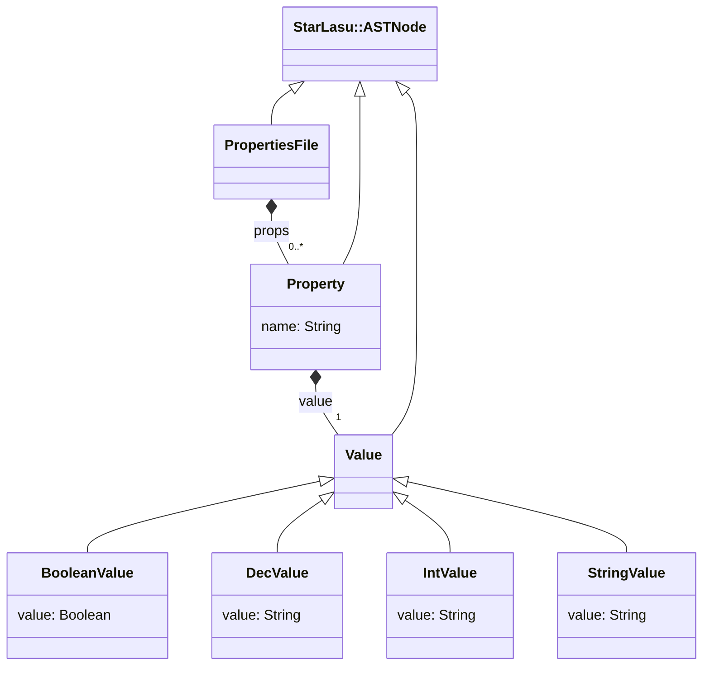

# LIonWeb MPS Meetup 2023 Demo

This project contains a demo of LIonWeb for the MPS Meetup 2023 event.

In the `properties-parser` directory we have a parser and code generator for a variant of the properties file format.

In the `mps` directory we have an MPS project which can import the properties language and its instances.

In the `freon` directory we have a web editor for the properties language.

Each directory contains a readme with more details.

## Prerequisites
* Java 11 installed and set as current JDK
* MPS 2021.1 installed
* yarn installed

## Setup

1. Open a shell / command window in this directory `mps-meetup-2023` (i.e. where you cloned https://github.com/LIonWeb-org/mps-meetup-2023)

2. Build _properties parser_ fat jar
   ```shell
   ./gradlew shadowJar
   ```
   
3. Download dependencies for MPS
   ```shell
   ./gradlew setup
   ```
   
4. We're using an unreleased development snapshot of Freon. Thus, we have to clone the sources:
   ```shell
   cd ..
   git clone -b lionweb https://github.com/freon4dsl/Freon4dsl.git
   ```
   
5. Build Freon source
   ```shell
   cd Freon4dsl
   yarn install
   yarn build-release --no-bail 
   ```
   
6. Adjust references to development snapshot:
   In file
   ```
   mps-meetup-2023/freon/package.json
   ```
   make sure these relative paths fit your system.
   They must refer to the development snapshot of Freon we cloned before.
   ```json
   "dependencies": {
     "@freon4dsl/core": "file:./../../../Freon4dsl/packages/core",
     "@freon4dsl/core-svelte": "file:./../../../Freon4dsl/packages/core-svelte",
     "@freon4dsl/meta": "file:./../../../Freon4dsl/packages/meta",
     "@freon4dsl/server": "file:./../../../Freon4dsl/packages/server",
   ```
   
7. Build Freon demo
   ```shell
   cd ..
   cd mps-meetup-2023
   cd freon
   yarn install
   ```

## Start
1. Open project `mps-meetup-2023/mps` in MPS 2021.1
2. Launch Freon demo
   ```shell
   cd mps-meetup-2023/freon
   yarn dev
   ```
3. Open your web browser on http://localhost:5000/


## Language Schema



You can learn more about LIonWeb visiting [https://lionweb.io](https://lionweb.io).
