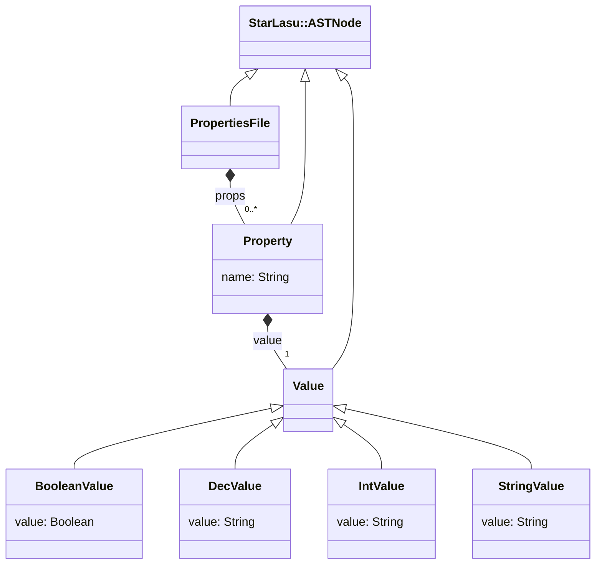

# LIonWeb MPS Meetup 2023 Demo

This project contains a demo of LIonWeb for the MPS Meetup 2023 event.

In the `properties-parser` directory we have a parser and code generator for a variant of the properties file format.

In the `mps` directory we have an MPS project which can import the properties language and its instances.

In the `freon` directory we have a web editor for the properties language.

## Language Schema

You can learn more about LIonWeb visiting [https://lionweb.io](https://lionweb.io).
