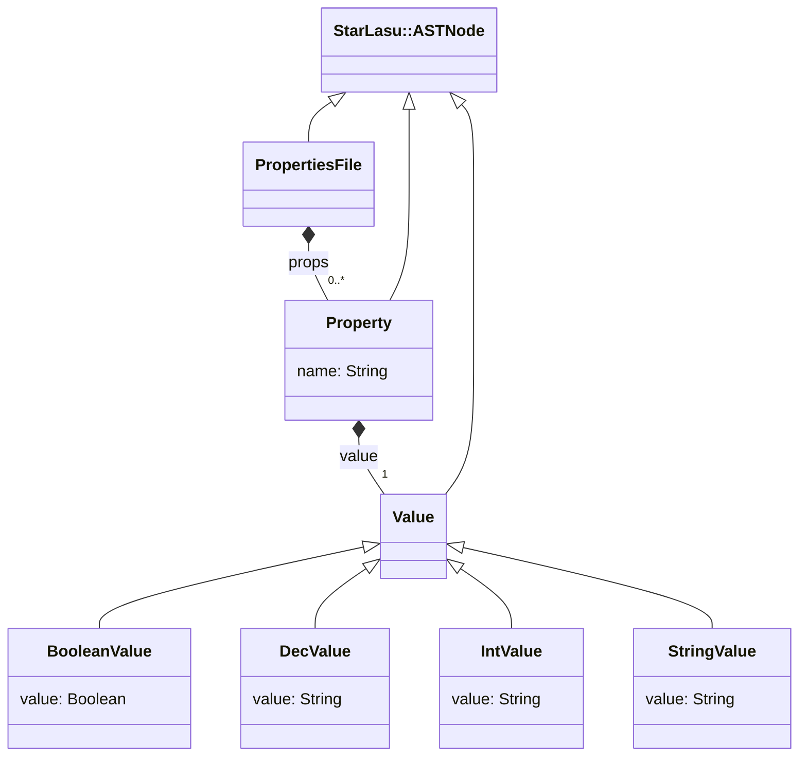

# LionWeb Property Demo

This project contains a demo application of LionWeb.
We presented a first version at MPS Meetup 2023, and an advanced version at LangDev 2023.

* `properties-emf` contains a converter from LionCore to Ecore and generator from Ecore to Java.

* `properties-json` contains a _lionweb-java_ representation of the PROPS language, and a helper to access PROPS language and instance.

* `properties-parser` contains a parser and code generator for a variant of the properties file format.

* `mps` contains an MPS project which hosts the PROPS language and its instances.

* `freon` contains a web editor for the PROPS language.

* `xtend-generators` contains a set of Xtend-based generators.

Each directory contains a readme with more details.

## Prerequisites
* Java 11 installed and set as current JDK
* MPS 2021.1 installed
* nodejs installed
* yarn installed

## Setup

1. Open a shell / command window in this directory `property-demo` (i.e. where you cloned https://github.com/LionWeb-io/property-demo)

2. Download dependencies for MPS
   ```shell
   ./gradlew setup
   ```

3. Open project `property-demo/mps` in MPS 2021.1 

4. Generate Kotlin classes for PROPS language
   ```shell
   ./gradlew generateASTClasses
   ```

5. Generate Ecore model for PROPS language
   ```shell
   ./gradlew properties-emf:run
   ```
  
6. Build Freon demo
   ```shell
   cd freon
   yarn install
   ```

## Start
1. Open project `property-demo/mps` in MPS 2021.1
2. Launch Freon demo
   ```shell
   cd freon
   yarn dev
   ```
3. Open your web browser on http://localhost:5000/


## Language Schema



You can learn more about LIonWeb visiting [https://lionweb.io](https://lionweb.io).
