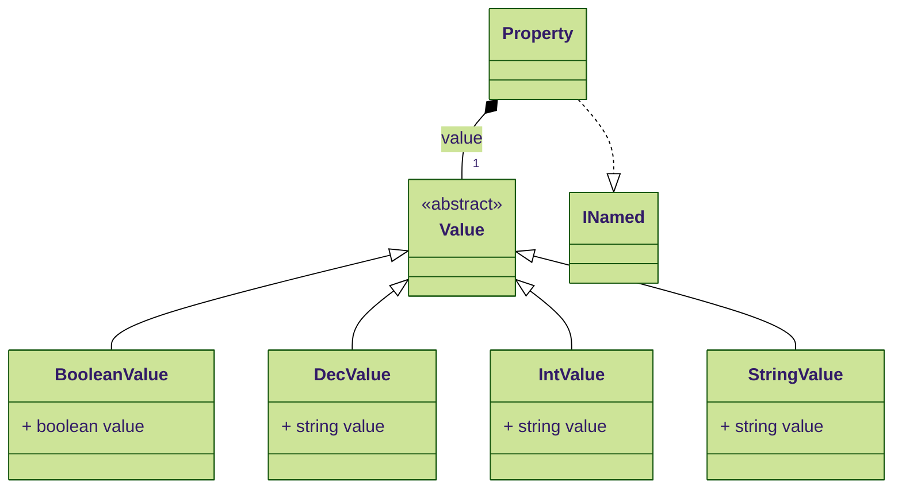

# Class diagram for file properties

```mermaid
    %%{init: {'theme': 'forest'} }%%
    classDiagram
    direction TD
    %% other possibilites: LR RL DT TB (same as TD)
    class Property {
        
        
    }
    class Value {
        <<abstract>>
        
    }
    class BooleanValue {
        
        + boolean value
    }
    class DecValue {
        
        + string value
    }
    class IntValue {
        
        + string value
    }
    class StringValue {
        
        + string value
    }

    Value <|-- BooleanValue
Value <|-- DecValue
Value <|-- IntValue
Value <|-- StringValue

        Property *-- "1" Value : value

        
        Property ..|> INamed

```
