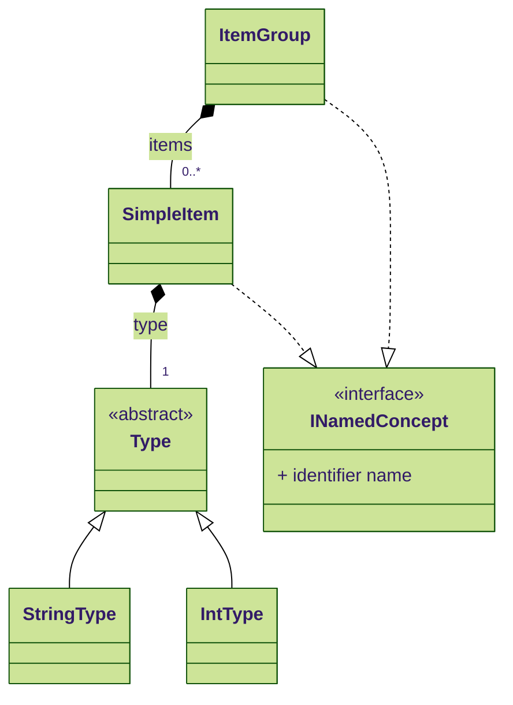

# Class diagram for language simpleforms

```mermaid
    %%{init: {'theme': 'forest'} }%%
    classDiagram
    direction TD
    %% other possibilites: LR RL DT TB (same as TD)
    class ItemGroup {
        
        
    }
    class SimpleItem {
        
        
    }
    class Type {
        <<abstract>>
        
    }
    class StringType {
        
        
    }
    class IntType {
        
        
    }
    class INamedConcept {
        <<interface>>
        + identifier name
    }
    Type <|-- StringType
Type <|-- IntType

        ItemGroup *-- "0..*" SimpleItem : items
SimpleItem *-- "1" Type : type

        
        ItemGroup ..|> INamedConcept
SimpleItem ..|> INamedConcept

```
