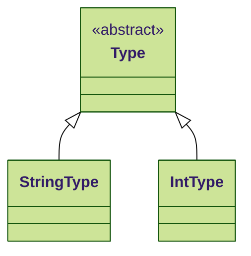

# Inheritance diagram for language simpleforms

```mermaid
    %%{init: {'theme': 'forest'} }%%
    classDiagram
    direction TD
    %% other possibilites: LR RL DT TB (same as TD)
    class StringType {
        
        
    }
    class Type {
        <<abstract>>
        
    }
    class IntType {
        
        
    }
    Type <|-- StringType
Type <|-- IntType

```
